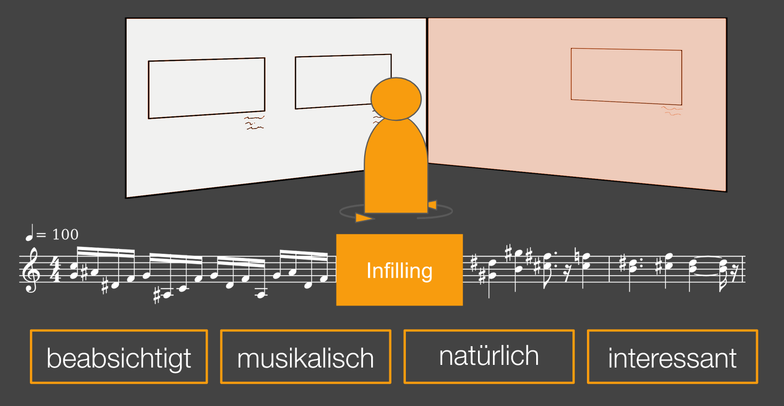

Musik ist eine Kunstform, die uns tief in die Emotionen und Stimmungen der Augenblicke eintauchen lässt. Doch was, wenn Musik mehr sein könnte als nur eine klangliche Begleitung zu Bildern? Was, wenn sie die Fähigkeit hätte, Bildergalerien in lebendige Geschichten zu verwandeln, die individuell auf den Betrachter zugeschnitten sind?

# Ein musikalischer Rundgang durchs Museum Barberini

In einem vierköpfigen Masterprojekt Team arbeiteten wir gemeinsam mit dem [Museum Barberini](https://www.museum-barberini.de/de/) in Potsdam, sowie dem Künstler [Henrik Schwarz](http://www.henrikschwarz.com/), an einem musikalisch begleitetem Rundgang durch die Impressionismus-Ausstellung des Museum Barberini.

Die zentrale Idee des Projektes war es, einem Besucher, der die Ausstellung erkundet, passende Musik zu den ausgestellten Bildern zu liefern. Während sich der Besucher durch die Ausstellung bewegt und von einer Gruppe Bildern zu den nächsten wechselt, wird das Musikstück auf intelligente Weise übergeleitet. Dieser Übergang zwischen den Themen erfolgt so geschmeidig, dass er nahezu unbemerkt bleibt. Die Musik passt sich an das Tempo des Betrachters an, sie folgt seinen Wegen und sorgt dafür, dass die künstlerischen Eindrücke durch die musikalische Untermalung noch eindrucksvoller werden.

<table style="min-width: 50%; margin: 20px; text-align: center; border: 1px solid #f4f4f4; float: right; border-radius: 2px;">
<tr>
<th>  </th>
</tr>
<tr>
<td> <i>Generierung künstlicher Übergänge beim Erkunden der Ausstellung</i> </td>
<tr>
</table>

Diese einzigartige Form der interaktiven künstlerischen Erfahrung sollte eine Hommage an die impressionistische Kunstbewegung des 19. Jahrhunderts sein, die sich durch ihre Betonung von Licht, Farbe und Atmosphäre auszeichnete. Ähnlich wie die Impressionisten die Welt in ständiger Veränderung eingefangen haben, bietet das Music Infilling dem Betrachter die Möglichkeit, die Kunst in einem fließenden Kontext zu erleben.

Diese Technologie hat das Potenzial, den Besuch von Kunstausstellungen zu revolutionieren. Sie schafft eine einzigartige Verbindung zwischen der visuellen und auditiven Kunst, die dem Betrachter eine tiefere und persönlichere Erfahrung ermöglicht. Mit dem Music Infilling wird Kunst zu einem multisensorischen Erlebnis, das sich dynamisch an den Weg und das Tempo des Einzelnen anpasst.

Unser Team beschäftigte sich vor allem mit der Forschung zur synthetischen Übergangsgenerierung zwischen zwei MIDI Dateien. Meine Aufgabe bestand darin, ein bestehendes KI-Modell auf unseren Servern mit unseren Daten zu trainieren, dabei verwendete ich das [Variable Length Infilling](https://arxiv.org/abs/2108.05064) Modell. 
Eine große Herausforderung in dem Projekt war die Beschaffung von Daten, mit denen das KI-Modell trainiert werden kann. Um solche Daten zu generieren, entwickelte ich einen neuen Ansatz, um simple synthetische Übergänge zwischen zwei Stücken zu generieren ([MIDI Spline Interpolation](https://github.com/markbader/midi-spline-interpolation)): Dafür stellte ich die Melodie des Anfangs- und des Endparts als kubische Spline Kurve dar und überführte die musikalischen Charakteristika des ersten Stückes zu den Charakteristika des zweiten Stückes. 

Um die generierten Übergänge in ein Format zu überführen, dass von den App-Entwicklern des Museum Barberini verwendet werden kann, baute ich eine Production Pipeline. Diese nahm die ursprünglichen MIDI Dateien als Eingabe, stößt die Inference des KI-Modells an und ordnet die erzeugten MIDI Dateien in einer gewünschten Ordnerstruktur an.

