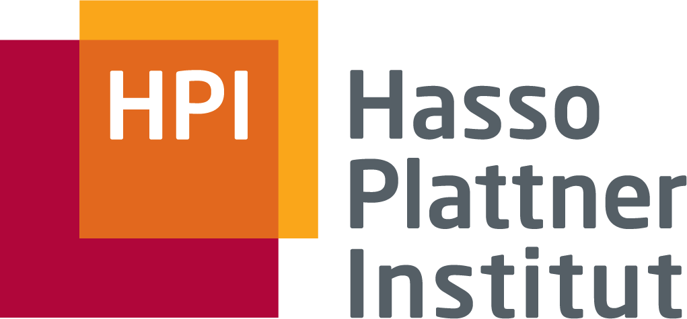

Willkommen auf meiner Seite! Ich bin Mark.

Ich lebe für die Technologie und liebe die Herausforderungen, die sie mit sich bringt. Als stolzer Vater von zwei wundervollen Kindern ist Familie für mich alles.

Derzeit studiere ich IT-Systems-Engineering am renommierten Hasso-Plattner-Institut, um schon bald meinen Masterabschluss zu erlangen. Hier tauche ich ein in die faszinierende Welt der Robotik, Human-Computer-Interaction und der Entwicklung eingebetteter Systeme. 

Während meines Berufs- und Studienlebens durfte ich bereits vielfältige Erfahrungen sammeln, sei es in der Anwendungsentwicklung, der Netzwerktechnik, dem Cybersecurity-Management oder der spannenden Welt der Künstlichen Intelligenz. 

Doch nicht nur die IT-Welt fasziniert mich – in meiner Freizeit lebe ich meine Leidenschaft für das Kochen und Backen aus. Ich liebe es, kreative Rezepte zu entwickeln und kulinarische Genüsse zu zaubern.

Auf dieser Seite möchte ich meine Leidenschaft für Technologie, Familie und kulinarische Abenteuer mit Ihnen teilen. 

&nbsp;

## Arbeitgeber

<table style="border: 10px solid #fff;">
<tr>
    <td style="width: 100px; padding-right: 30px; vertical-align: top;"> 
         </td>
    <td> 
        <b> Data-Engineer @ acs-plus </b>  
        Feb. 2021 - Sep. 2021  
        Webentwicklung und automatisierte Tests.
    </td>
</tr>
</table>

<table style="border: 10px solid #fff;">
<tr>
    <td style="width: 100px; padding-right: 30px; vertical-align: top;"> 
         
    </td>
    <td> 
        <b> Dozent @ HPI Digitalkolleg </b> 
        Nov. 2021 - Dez. 2021  
        Vorbereitung und Durchführung eines Python Kurses.
    </td>
</tr>
</table>

<table style="border: 10px solid #fff;">
<tr>
    <td style="width: 100px; padding-right: 30px; vertical-align: top;"> 
         
    </td>
    <td> 
        <b> Software Entwickler @ scalable minds </b> 
        seit Apr. 2023  
        Betreuung der Python Bibliotheken.
    </td>
</tr>
</table>